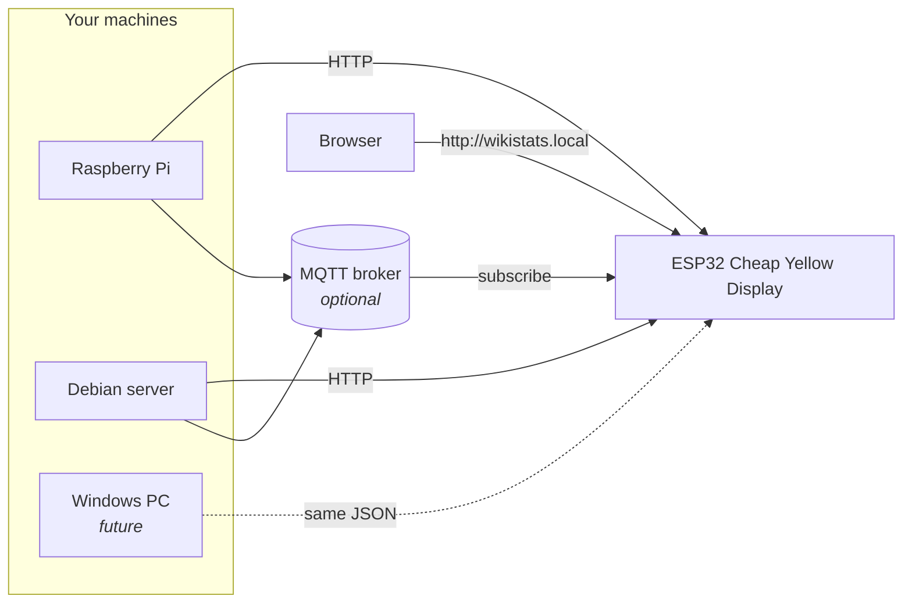
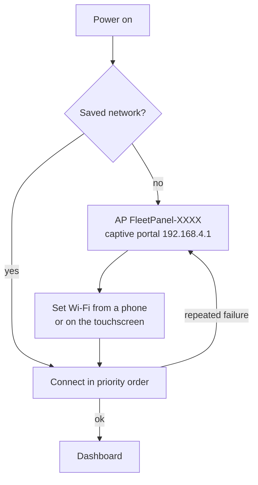

# WikiStats

**A desk panel that shows what your machines are doing.**

WikiStats (project name *FleetPanel*) monitors Linux and Raspberry Pi computers —
and, once someone writes the agent, Windows ones — on a 320 × 240 ESP32 touchscreen.
One page per machine, swipe between them, or let it rotate on its own.

No cloud. No broker required. No database. No Home Assistant. Nothing on your
network that can run a command on a monitored machine.



## What you get

**On the panel** — CPU percentage and temperature, RAM bar with used/total, storage
bar with used/free/total, download and upload rates, uptime, how old the reading is,
and small CPU and RAM sparklines. Warning and critical states are shown with a text
tag as well as a colour, so they survive a glossy resistive overlay and colour-blind
eyes alike.

**On any browser** — a configuration website served from the panel itself. Devices,
Wi-Fi, MQTT, thresholds, carousel, brightness, backup, firmware update. It works
with no internet access; nothing is loaded from a CDN.

**On each machine** — a small read-only Python service. It measures, it serves JSON,
and that is all it can do.

## Supported hardware

| | |
| --- | --- |
| Panel | **ESP32-2432S028R** ("Cheap Yellow Display") — 320 × 240 ILI9341, XPT2046 resistive touch, ESP32-WROOM-32, 4 MB flash, **no PSRAM** |
| Other CYD variants | supported by adding one file behind `src/hal/display_hal.h` |
| Agents | Debian 12+, Ubuntu 22.04+, Raspberry Pi OS bookworm+, Python 3.11+ |

## Architecture in one paragraph

Agents publish one versioned JSON document, `fleetpanel.telemetry.v1`, over HTTP
and optionally MQTT. The panel discovers them over mDNS, retained MQTT metadata, or
manual entry; merges duplicates by a stable hashed device ID; and renders them. The
document format is a shared artefact with a formal JSON Schema, and the agent ships
a byte-identical copy that a test compares against the canonical one — which is what
lets a future Windows agent work with firmware built today.

Details: [`docs/architecture.md`](docs/architecture.md).

## Quick start

### 1. Install an agent

```bash
git clone https://github.com/fleetpanel/wikistats.git
cd wikistats/agent
sudo ./install.sh
```

It prints the URL when it is done. Check it:

```bash
curl -s http://127.0.0.1:8770/api/v1/health
```

```json
{ "status": "ok", "schema": "fleetpanel.telemetry.v1", "agent_version": "0.1.0" }
```

Full walkthrough with a Raspberry Pi and a Debian example:
[`docs/linux-installation.md`](docs/linux-installation.md).

### 2. Build the web assets and flash the panel

```bash
cd web && npm install && npm run build
```

```bash
cd ../firmware && pio run -e cyd
```

```bash
pio run -e cyd -t uploadfs
```

```bash
pio run -e cyd -t upload
```

Full walkthrough: [`docs/esp32-installation.md`](docs/esp32-installation.md).

### 3. First boot

With no saved network the panel opens an access point called `FleetPanel-XXXX` and
shows its name and address on screen.



Join it from a phone, set your Wi-Fi, then set an administrator password. Or do the
whole thing on the touchscreen: gear → Wi-Fi.

### 4. Add machines

Agents advertising `_fleetpanel._tcp.local.` appear under **Discovered devices** —
approve them, or switch on automatic adding. On a network where multicast is
blocked, add them by address: Devices → *Add a device manually*.

## Using it

| Gesture | Result |
| ------- | ------ |
| Swipe left / right | previous / next machine |
| Tap the device name | device information |
| Tap a metric card | detail dialog for that metric |
| Tap the gear | settings |
| Long-press the page dots | device list |
| Any touch | pauses the carousel for 30 s |

A swipe needs at least 45 px of horizontal travel and must be mostly horizontal, so
scrolling never flips the page by accident.

## REST mode and MQTT mode

**REST** is the default and needs nothing extra. The panel polls each device every
`poll_interval_ms` (default 3 s), with per-device backoff when one stops answering.

**MQTT** is optional. Enable it on the agent and on the panel and telemetry arrives
by push instead:

```text
fleetpanel/v1/devices/<device_id>/meta           retained, QoS 1
fleetpanel/v1/devices/<device_id>/telemetry      retained, QoS 0 or 1
fleetpanel/v1/devices/<device_id>/availability   retained, QoS 1, "online"/"offline"
```

`availability` is backed by a Last Will, so a crashed agent flips to `offline` at the
broker without waiting for a timeout. Full contract:
[`shared/mqtt-topics.md`](shared/mqtt-topics.md).

**Automatic** mode prefers MQTT while it is connected *and delivering recent
samples*, and falls back to HTTP otherwise. Connection alone is not enough — a
broker that is up with no publisher looks healthy and would leave every tile blank.

## The telemetry document

```json
{
  "schema": "fleetpanel.telemetry.v1",
  "timestamp": "2026-07-28T20:45:30Z",
  "sequence": 1234,
  "device": {
    "id": "f6a3f749c2dd", "name": "WikiHermes", "hostname": "wikihermes",
    "platform": "linux", "os_name": "Debian GNU/Linux 12", "os_version": "12",
    "kernel": "6.6.31+rpt-rpi-v8", "architecture": "aarch64",
    "hardware_model": "Raspberry Pi 4 Model B Rev 1.5", "agent_version": "0.1.0"
  },
  "status": { "state": "online", "uptime_seconds": 348122, "boot_time": "2026-07-24T20:03:28Z",
              "process_count": 143, "logged_in_users": 1 },
  "cpu": { "usage_percent": 17.4, "per_core_percent": [14.0, 22.1, 13.6, 19.8],
           "physical_cores": 4, "logical_cores": 4, "frequency_mhz": 1800.0,
           "load_1": 0.41, "load_5": 0.30, "load_15": 0.27, "temperature_c": 48.2,
           "temperatures": [{ "label": "cpu", "temperature_c": 48.2, "high_c": 80.0, "critical_c": 90.0 }] },
  "memory": { "total_bytes": 8589934592, "available_bytes": 5368709120, "used_bytes": 3221225472,
              "free_bytes": 4294967296, "usage_percent": 37.5, "swap_total_bytes": 1073741824,
              "swap_used_bytes": 134217728, "swap_free_bytes": 939524096, "swap_usage_percent": 12.5 },
  "storage": { "total_bytes": 62538170368, "used_bytes": 27692531712, "free_bytes": 34845638656,
               "usage_percent": 44.3, "mounts": [ /* … */ ] },
  "network": { "primary_interface": "eth0", "ip_addresses": ["192.168.1.50"],
               "rx_bytes_total": 28478212231, "tx_bytes_total": 9876241132,
               "rx_bytes_per_second": 24563.2, "tx_bytes_per_second": 4311.7 },
  "optional": { "gpu": null, "battery": null },
  "capabilities": ["cpu", "cpu_temperature", "memory", "swap", "storage", "network"]
}
```

Bytes for sizes, bytes per second for rates, Celsius, MHz, 0–100 percentages,
seconds for uptime, UTC ISO 8601 timestamps. Anything the host cannot measure is
`null` and drops out of `capabilities` — never omitted, never faked.

Field-by-field: [`docs/protocol.md`](docs/protocol.md).
Formal schema: [`shared/telemetry-v1.schema.json`](shared/telemetry-v1.schema.json).

## Agent HTTP API

| Method | Path | Auth | Purpose |
| ------ | ---- | ---- | ------- |
| GET | `/api/v1/health` | no | liveness |
| GET | `/api/v1/schema` | no | the JSON Schema |
| GET | `/api/v1/info` | yes | agent metadata |
| GET | `/api/v1/telemetry` | yes | latest sample |
| GET | `/api/v1/history?seconds=300` | yes | bounded ring buffer |
| GET | `/api/v1/config/public` | yes | non-secret configuration |
| GET | `/api/v1/stream` | yes | server-sent events |
| GET | `/docs` | no | OpenAPI UI |

Every route is a `GET`. There is no command execution, no shell, no reboot and no
file access anywhere in the API, and a test enumerates the route table to keep it
that way.

## Testing without five computers

```bash
python -m fleetpanel_agent.simulator --devices 5 --port-start 8800
```

Five synthetic machines on five ports, each with its own stable ID and mDNS record,
with values that move smoothly and independently. This is the only place in the
project that fabricates telemetry.

## Development

```bash
cd agent
python -m venv .venv
source .venv/bin/activate
pip install -e ".[dev]"
pytest
ruff check .
mypy src
```

```bash
cd firmware
pio run
pio test -e native
pio run -t upload
pio run -t uploadfs
pio device monitor
```

```bash
cd web
npm install
npm run build
```

## Debugging a panel that is already on the wall

```bash
nc wikistats.local 23
```

Every log line also goes to TCP port 23 and to `GET /api/logs`. It is output-only:
anything typed at it is discarded, so it can never become a command channel.

Firmware updates over the air:

```bash
pio run -e cyd-ota -t upload --upload-port wikistats.local --upload-flags --auth=YOURPASSWORD
```

## Security, honestly

Designed for a **trusted LAN**. Telemetry and the panel's admin password cross your
network in clear text; HTTPS is not offered because certificate management on a
clockless ESP32 is worse than the problem it solves. The setup portal is briefly an
open access point. MQTT TLS on the panel encrypts but does not verify the broker.

What *is* guaranteed: the agent cannot be made to run anything, credentials are
never logged or returned by a read endpoint, the admin password is PBKDF2-hashed,
mutating requests need a CSRF token, and login attempts are rate limited.

The full list of limitations, stated plainly:
[`docs/security.md`](docs/security.md).

## Troubleshooting

Common failures and what they mean:
[`docs/troubleshooting.md`](docs/troubleshooting.md).

## Future Windows support

The protocol was designed for this from the start, so a Windows agent needs **no
firmware change and no panel setting**. It has to emit the same document with
`platform: "windows"` and `null` for what it cannot measure (CPU temperature usually
needs WMI or a vendor driver, so `cpu.temperature_c` will often be `null` — the
panel already hides the tile and drops the capability).

There is already a firmware test that parses a Windows-shaped document to prove the
parser needs nothing new. Suggested route:

1. Reuse `fleetpanel_agent` unchanged for the API, config, MQTT and discovery layers
   — they are platform-neutral.
2. Add `collectors/windows.py` for the parts psutil cannot do: `hardware_model` from
   `Win32_ComputerSystem`, `os_name`/`os_version` from `Win32_OperatingSystem`,
   temperatures from `MSAcpi_ThermalZoneTemperature` where the vendor exposes it.
3. Set `platform: "windows"` in `HostCollector._platform_family` — already
   implemented.
4. Package with a service wrapper instead of systemd.
5. Validate against `shared/telemetry-v1.schema.json` in CI, exactly as the Linux
   agent does.

## Repository layout

```text
wikistats/
├── agent/            Python telemetry agent, installer, systemd unit, tests
├── firmware/         PlatformIO ESP32 firmware
│   ├── lib/fleet_core/   platform-independent, host-testable core
│   ├── src/hal/          display and touch abstraction
│   ├── src/net/          transports, discovery, web server, OTA
│   ├── src/ui/           LVGL screens
│   └── test/             native unit tests
├── web/              Vite + TypeScript configuration website
├── shared/           JSON Schemas, example document, MQTT contract
├── docs/             architecture, protocol, installation, discovery, security
└── .github/workflows/
```

## Licence

MIT — see [`LICENSE`](LICENSE). Dependency licences, including the two LGPL
libraries and what that implies, are listed in
[`docs/architecture.md`](docs/architecture.md#licences).
