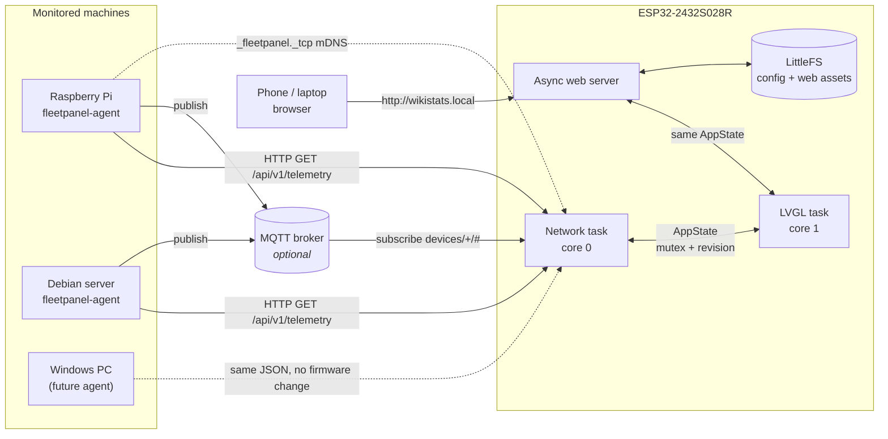
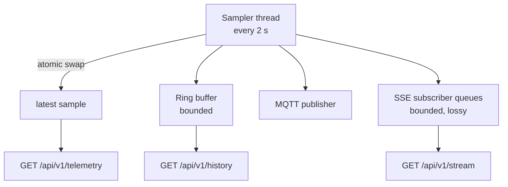
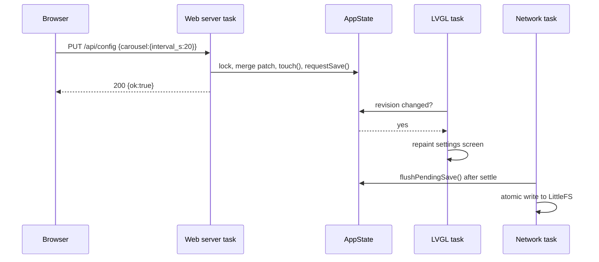
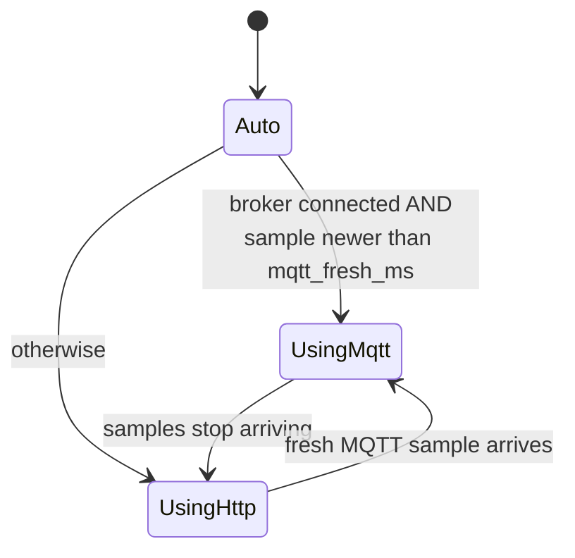
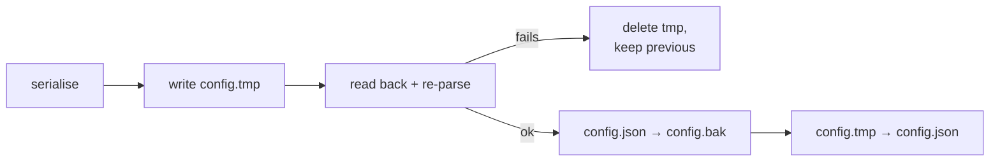

# Architecture

## The shape of the system



Two independent halves that share one document format:

* **Agents** measure and serve. They never push configuration, never accept
  commands, and never need to know a panel exists.
* **The panel** discovers, polls, renders and stores. It never runs anything on a
  monitored machine.

Nothing in the middle is required. No cloud, no broker, no database, no Home
Assistant.

## Why the protocol comes first

The single most important design decision is that `fleetpanel.telemetry.v1` is a
*shared artefact*, not an agent implementation detail:

* `shared/telemetry-v1.schema.json` is the normative document.
* The agent ships a byte-identical copy inside its wheel, and a test fails if the
  two ever drift.
* The firmware parser is written against the schema and tested against the same
  example file the schema validates.

A Windows agent that emits this document works with firmware built today. That is
the whole point, and it is why `null` is mandatory rather than optional: an agent
that omits fields it cannot fill would force the firmware to guess.

## Agent process model



One daemon thread owns all measurement. HTTP handlers only read the last completed
document from an atomically swapped reference.

That structure is what satisfies "must not block for one second while measuring CPU
usage": `psutil.cpu_percent(interval=None)` reports usage since the previous call,
so the sampler's fixed cadence *is* the measurement window and a request never
waits for one.

Failure policy: each subsystem is collected inside its own guard. A collector that
raises contributes `null`s, drops its capability, and flips `status.state` to
`degraded` **for that sample only**. The agent keeps serving everything else. There
is a test that fails every collector at once and still requires a schema-valid
document.

## Panel task model

| Task | Core | Owns | May block? |
| ---- | ---- | ---- | ---------- |
| `loop()` / LVGL | 1 | touch, rendering, animation, carousel | never |
| `wikistats-net` | 0 | Wi-Fi, mDNS, HTTP polling, MQTT, OTA, log console | yes |
| AsyncTCP (library) | 0 | web server request handling | no |

The split is the reason a device that times out after four seconds does not drop a
frame. `HTTPClient` is a blocking API and that is fine — it blocks the network task,
which has nothing else to do while it waits.

Shared state lives in one `AppState` behind a recursive mutex. Every mutation bumps
a revision counter; the UI repaints when the counter changes. That is what makes a
setting altered in the browser appear on the touchscreen immediately and vice versa,
without either side polling the other.



Note what the web handler does *not* do: it does not write flash. Writing is
deferred to the network task after a settle delay, which coalesces a burst of
slider movements into one flash write.

## Transport selection



"Connected" alone is not enough to prefer MQTT. A broker that is up with no
publisher looks perfectly healthy and would leave every tile blank for ever, so the
policy also requires a recent sample *for that device*.

## Storage

```text
0x009000  nvs        20 KiB   boot counter, Arduino internals
0x00e000  otadata     8 KiB
0x010000  app0     1856 KiB   running firmware
0x1e0000  app1     1856 KiB   OTA target
0x3b0000  littlefs  256 KiB   config.json, config.bak, /www/*.gz
0x3f0000  coredump   64 KiB
```

Two app slots are not optional. Firmware update writes the inactive one and only
switches over after a successful verify, so a failed update on a wall-mounted panel
is an inconvenience rather than a disassembly job.

Configuration writes are atomic:



Power loss at any point leaves at least one complete, parseable document. On load,
a corrupt primary falls back to the backup, and a corrupt backup falls back to
defaults — logged, never silent.

## Memory discipline on a PSRAM-less ESP32

The board has ~290 KiB of usable DRAM shared between Wi-Fi, TLS, JSON and the UI.
Everything that could grow without bound is capped instead:

| Thing | Bound | Where |
| ----- | ----- | ----- |
| LVGL draw buffer | 320 × 40 px = 25 KiB, DMA-capable | `ui.cpp` |
| LVGL heap | system heap (`LV_MEM_CUSTOM`) | `lv_conf.h` |
| Telemetry payload | `max_payload_bytes`, default 16 KiB, checked before parsing | `fp_telemetry.cpp` |
| JSON document | ArduinoJson filter — only rendered fields are allocated | `fp_telemetry.cpp` |
| Per-core list | 16 entries | `fp_telemetry.h` |
| Temperature list | 6 entries | `fp_telemetry.h` |
| Mount list | 4 entries | `fp_telemetry.h` |
| Per-device history | 60 × `uint8` × 2 metrics = 120 B, fixed array | `fp_devices.h` |
| Devices | 24 | `fp_devices.h` |
| Saved Wi-Fi networks | 8 | `fp_config.h` |
| Log ring | 6 KiB static | `log.cpp` |
| Web request body | 16 KiB | `web_server.cpp` |
| Sessions | 4 | `web_server.cpp` |

There is no `String` concatenation in any render or log path; formatting goes
through `snprintf` into stack buffers.

Measured on the real board: **68 KB static RAM (20.8 %)**, ~199 KB free heap after
startup.

## Testability

The parts that are painful to debug through a 320 × 240 screen live in
`firmware/lib/fleet_core/`, which contains no Arduino headers and compiles on a PC:

* telemetry parsing and its defensive rules
* unit formatting
* threshold and freshness evaluation
* swipe recognition
* carousel timing
* device merging, dedup and ordering
* configuration migration and secret redaction
* MQTT topic construction and parsing

`pio test -e native` runs 120 test cases against them in about four seconds. The
Arduino-dependent layers above (HAL, transports, web server, LVGL screens) are
verified on hardware.

## Licences

| Component | Licence |
| --------- | ------- |
| WikiStats / FleetPanel | MIT |
| LVGL 8.3.11 | MIT |
| TFT_eSPI 2.5.43 | FreeBSD (2-clause BSD) |
| XPT2046_Touchscreen 1.4 | MIT |
| ArduinoJson 7.2.1 | MIT |
| PubSubClient 2.8 | MIT |
| AsyncTCP 3.5.0 | LGPL-3.0 |
| ESPAsyncWebServer 3.12.0 | LGPL-3.0 |
| Arduino-ESP32 core | LGPL-2.1 |
| FastAPI, Uvicorn, psutil, pydantic, zeroconf | BSD / Apache-2.0 / MIT |
| paho-mqtt | EPL-2.0 / EDL-1.0 |

The two LGPL libraries are linked, not modified. Distributing a binary built from
this repository therefore carries the LGPL's relinking obligation, which is
satisfied by this repository being public and the build being reproducible with
`pio run`. No dependency conflicts with the MIT licence on the project's own code.
