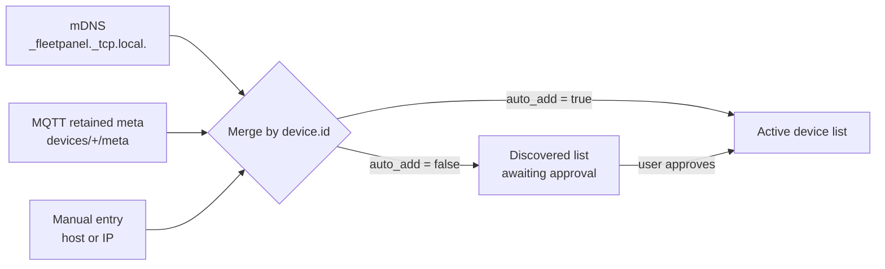

# Discovery

Three ways a panel learns about a machine. All of them key on the agent's stable
`device.id`, so the same machine found three ways is one entry.



## 1. mDNS

The agent advertises with the Python `zeroconf` library rather than shelling out to
`avahi-publish`, so discovery works on images that do not ship Avahi and the agent
controls its own TXT records.

**Service type** `_fleetpanel._tcp.local.`
**Instance name** `<display-name>-<first 8 of device id>._fleetpanel._tcp.local.`

The ID suffix is not decoration: two machines called `server` would otherwise
collide in the DNS-SD namespace.

**TXT records**

| Key | Required | Value | Fallback if absent |
| --- | -------- | ----- | ------------------ |
| `id` | **yes** | stable device ID | responder is ignored |
| `name` | no | display name | mDNS hostname |
| `schema` | no | `1` | `1`; anything else is ignored |
| `path` | no | `/api/v1/telemetry` | `/api/v1/telemetry` |
| `transport` | no | `http` | `http` |
| `auth` | no | `none` or `token` | `none` |
| `platform` | no | `linux`, `windows`, … | `linux` |

`id` is the one field the panel cannot invent. Without it, two agents could be
merged into one entry, or one agent could appear twice after a DHCP change — so a
responder without it is skipped and logged.

Verify from another machine:

```bash
avahi-browse -rt _fleetpanel._tcp
```

```bash
dns-sd -B _fleetpanel._tcp        # macOS
```

The panel queries every `discovery.interval_s` (default 60 s), and immediately when
you press *Find agents* or `POST /api/discovery/scan`.

## 2. MQTT retained metadata

With a broker configured the panel subscribes to:

```text
fleetpanel/v1/devices/+/meta            # QoS 1 — discovery + naming
fleetpanel/v1/devices/+/availability    # QoS 1 — fast up/down
fleetpanel/v1/devices/+/telemetry       # QoS 0 — data
```

Because `meta` is retained, a panel that boots after the agents learns about the
whole fleet in one broker round trip instead of waiting a full sampling interval.

The `meta` document carries `http.addresses` and `http.port`, so an MQTT-discovered
device can still be polled over HTTP if the broker later goes away. That is what
makes `transport.mode = "auto"` degrade gracefully rather than going blank.

Full topic contract: [`shared/mqtt-topics.md`](../shared/mqtt-topics.md).

## 3. Manual entry

For agents on another subnet, or where mDNS is blocked (many enterprise and guest
networks block multicast).

Web interface → Devices → *Add a device manually* → `http://192.168.1.50:8770`.

A manual entry has no stable ID until the first successful poll, so the panel
assigns a provisional one derived from the URL and replaces it when the agent
reports its own.

## Merge rules

The part that is easy to get wrong. When a device is rediscovered:

**Always preserved** — alias, display order, enabled, hidden, carousel membership,
API token. Losing a hand-typed alias because a machine rebooted would be
infuriating.

**Refreshed from discovery** — base URL, path, auth mode, platform, *but only when
the entry was itself discovered*. A manually entered URL is never overwritten by an
mDNS record; if you typed an address, you meant it.

**Adopted from telemetry** — the agent's own `device.name`, but only while no alias
is set, so a renamed host shows up without touching the panel.

There is a native test for each of these rules
(`firmware/test/test_core/test_devices.cpp`).

## Approval

By default discoveries land in a *Discovered* list rather than appearing on the
dashboard. On a network with a dozen agents, silently adding all of them would make
the carousel useless on first boot.

Turn on *Add discovered devices automatically* (`discovery.auto_add`) if you would
rather they appear straight away.

## Panel discoverability

The panel advertises itself as `_http._tcp` with `product` and `version` TXT
records, so `http://wikistats-XXXX.local/` works from a browser. It never advertises
`_fleetpanel._tcp` — it is a consumer of that service, never a provider.

## When discovery does not work

| Symptom | Cause | Fix |
| ------- | ----- | --- |
| Nothing found, agent healthy | multicast blocked between VLANs or by the AP | add the device manually |
| Found, then goes offline | DHCP moved the agent | rescan, or give the agent a reservation |
| Two entries for one machine | two agents with different IDs (e.g. a container and its host) | set `agent.device_id` explicitly on one |
| Found but never updates | agent requires a token the panel does not have | set the token on the device row |
