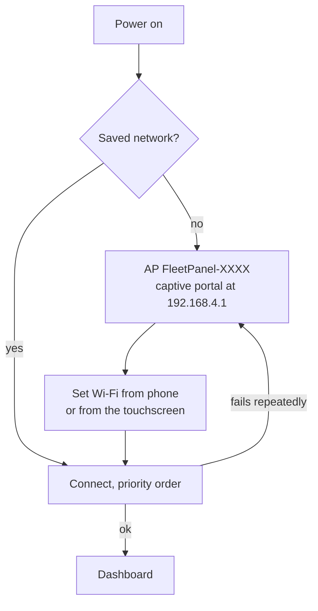

# Flashing and setting up the panel

## Hardware

**ESP32-2432S028R**, sold as the "Cheap Yellow Display" or CYD.

| | |
| --- | --- |
| MCU | ESP32-WROOM-32 (ESP32-D0WD-V3), 4 MB flash, **no PSRAM** |
| Display | 320 × 240 ILI9341 over HSPI |
| Touch | XPT2046 resistive, on a **separate** VSPI bus |
| Extras | RGB LED, LDR, micro-SD slot, speaker |
| USB | CH340 serial bridge — install its driver if the port does not appear |

Pin map (all set from `platformio.ini`, so a variant is a build-flag change):

| Function | Pin | | Function | Pin |
| --- | --- | --- | --- | --- |
| TFT MOSI | 13 | | Touch CLK | 25 |
| TFT MISO | 12 | | Touch MOSI | 32 |
| TFT SCLK | 14 | | Touch MISO | 39 |
| TFT CS | 15 | | Touch CS | 33 |
| TFT DC | 2 | | Touch IRQ | 36 |
| TFT RST | tied to EN | | LED R/G/B | 4 / 16 / 17 |
| Backlight | 21 | | LDR | 34 |

## Build

```bash
cd firmware
pio run -e cyd
```

Build the web assets first if you have changed them:

```bash
cd web && npm install && npm run build
```

That writes gzipped files into `firmware/data/www/`.

## Flash over USB (first time)

Filesystem first, then firmware:

```bash
pio run -e cyd -t uploadfs --upload-port COM6
```

```bash
pio run -e cyd -t upload --upload-port COM6
```

On Linux the port is usually `/dev/ttyUSB0`; drop `--upload-port` entirely and
PlatformIO will pick the only board it finds.

Watch it boot:

```bash
pio device monitor -p COM6 -b 115200
```

```text
[      50][i][main] WikiStats 0.1.0
[      50][i][main] telemetry schema fleetpanel.telemetry.v1
[      50][i][main] chip ESP32-D0WD-V3 rev 3, 240 MHz, flash 4 MB
[     520][i][state] boot #1, reset reason: power-on
[     834][i][main] panel: ESP32-2432S028R (Cheap Yellow Display) (ILI9341 + XPT2046)
[     920][i][ui] UI ready (25600 byte draw buffer, free heap 207772)
[    1154][w][wifi] setup portal up: SSID FleetPanel-765E, http://192.168.4.1 (no saved networks)
[    1259][i][web] web server listening on port 80
```

## First boot — Wi-Fi setup

With no saved network the panel starts an open access point and a captive portal.
The screen shows the AP name and address.



**From a phone or laptop**

1. Join `FleetPanel-XXXX` (open network).
2. The "sign in to network" sheet opens automatically; if not, browse to
   `http://192.168.4.1/`.
3. Wi-Fi → pick a network → password → Connect.
4. Set an administrator password when prompted.

**From the touchscreen**

Gear → Wi-Fi → Refresh → tap a network → type the password on the on-screen
keyboard (the eye button reveals it) → ✓.

Saved passwords are never shown again, on either interface.

## Everyday access

Once on your network: `http://wikistats-XXXX.local/`, where `XXXX` is the last four
hex digits of the chip ID. The exact name is on the diagnostics screen, in the boot
log, and in `GET /api/status` as `wifi.hostname`. It is derived from the chip so two
panels on one network do not collide, and it is editable on the Display page.

If mDNS does not resolve (common on Windows without Bonjour, and on networks that
block multicast), use the IP address shown on the diagnostics screen.

## Adding devices

* **Automatic** — agents advertising `_fleetpanel._tcp.local.` appear under
  *Discovered devices*. Approve them, or turn on *Add discovered devices
  automatically*.
* **MQTT** — with a broker configured, retained `meta` messages populate the same
  list within one round trip.
* **Manual** — Devices → Add a device manually → `http://192.168.1.50:8770`.

## Using the panel

| Gesture | Result |
| ------- | ------ |
| Swipe left / right | previous / next machine |
| Tap the device name | device information |
| Tap a metric card | detail for that metric |
| Tap the gear | settings |
| Long-press the page dots | device list |
| Any touch | pauses the carousel for 30 s |

A swipe needs ≥ 45 px of horizontal travel and must be mostly horizontal, so
scrolling a list never flips the page.

## Over-the-air updates

Set an administrator password first (OTA refuses to start without one — an
unauthenticated OTA listener on a LAN is remote code execution).

The password goes in an environment variable, not on the command line —
`--upload-flags` is not a `pio run` option:

```bash
PLATFORMIO_UPLOAD_FLAGS=--auth=YOURPASSWORD pio run -e cyd-ota -t upload --upload-port wikistats-XXXX.local
```

On Windows PowerShell:

```bash
$env:PLATFORMIO_UPLOAD_FLAGS="--auth=YOURPASSWORD"; pio run -e cyd-ota -t upload --upload-port wikistats-XXXX.local
```

**If it prints `Authenticating...OK` and then `No response from device`**, the panel
authenticated fine and then could not open its connection *back* to your machine.
That is a host firewall blocking inbound TCP to python, not a device fault. Either
allow it, or use the web uploader instead.

**Web uploader** — *Firmware update* page, choose `.pio/build/cyd/firmware.bin`,
upload. It only makes outbound connections from your browser, so no firewall rule is
needed. Measured at roughly 16 s for a 1.7 MB image over 2.4 GHz Wi-Fi.

Both paths write the inactive OTA slot and only switch over after a successful
verify.

## Remote serial console

Once on Wi-Fi the panel mirrors every log line to TCP port 23:

```bash
nc wikistats-XXXX.local 23
```

It is output-only — anything typed is discarded, so it can never become a command
channel. The same buffer is available at `GET /api/logs` and on the *System
information* page. Disable it on the Security page if you would rather it were not
listening.

## Recovery

Hold a finger on the touchscreen while powering up. After three seconds the panel
starts its setup portal **without erasing** saved networks, devices or settings —
the RGB LED turns amber while the timer runs.

A full wipe is Settings → Diagnostics → Factory, or the web interface's *Restart and
factory reset* page.

## Adding another CYD variant

Everything hardware-specific is behind `src/hal/display_hal.h`. A new board needs:

1. a new `src/hal/display_<board>.cpp` implementing `hal::DisplayHal`, and
2. a pin block plus a `TFT_eSPI` driver selection in a new `platformio.ini`
   environment.

Nothing in the UI, the transports or the configuration model changes.
